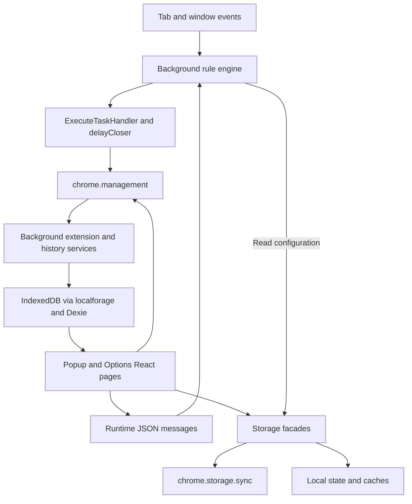

# Project Overview

Extension Manager is a Manifest V3 browser extension for Chrome and Edge that manages installed
extensions through a popup and an options dashboard. It supports manual and grouped enable/disable
actions, automatic rules based on URLs, scenes, operating systems and time periods, extension
sharing/import, configuration backups and operation history. The application uses React 19,
Ant Design 6, styled-components, JavaScript and TypeScript. Webpack 5 produces browser packages.

## Repository Structure

- `src/`: Extension source, browser manifest and bundled resources.
  - `pages/Background/`: Service worker initialization, browser events, rules, messages and history.
    - `rule/`: Rule conversion, matching, target resolution and enable/disable execution.
    - `extension/`: Installed-extension metadata and icon cache services.
    - `history/`: History records, persistence and event classification.
    - `event/` and `message/`: Browser listeners and messages from extension pages.
  - `pages/Popup/`: Popup entry, list/grid views, search, groups and scene controls.
  - `pages/Options/`: Dashboard for management, rules, groups, scenes, history, sharing and settings.
  - `storage/`: Synchronized configuration, local state and compression/storage helpers.
  - `styles/`: Shared light/dark themes, Ant Design tokens and theme observation.
  - `types/`: Configuration, rule, browser-context and asset type declarations.
  - `utils/`: Runtime helpers, messaging, analytics and generated package-channel metadata.
  - `_locales/`: Chrome i18n messages for `en`, `ja`, `ru`, `zh`, `zh_CN` and `zh_TW`.
  - `assets/`: Icons, logos and other image assets.
- `test/`: Node.js regression tests and their usage guide.
- `utils/`: Node.js build, packaging and development-server scripts; not runtime helpers.
- `.vscode/`: Shared editor settings; the local Chrome profile directory is ignored.
- `build/`: Generated unpacked extension, ignored by Git and replaced by builds.
- `zip/`: Generated Chrome/Edge release archives, ignored by Git.
- `node_modules/`: Installed dependencies, ignored by Git.
- Root files: READMEs, debugging guide, license, npm lockfile and compiler/linter/formatter configs.

## Build & Development Commands

Run commands from the repository root. Use Node.js 24.11+ within the 24.x line and npm: tests import
TypeScript directly, and the locked Babel 8 packages require a sufficiently recent Node.js version.

> TODO: Pin Node.js/npm versions; no root `engines` declaration or version file exists.

Install the locked dependencies:

```sh
npm ci
```

Before building, create `src/utils/secret.js` from `src/utils/secret.demo.js` if it is missing.
Placeholder values are sufficient for local compilation. Do not overwrite existing credentials.
For example, in PowerShell:

```powershell
if (!(Test-Path -LiteralPath src/utils/secret.js)) {
  Copy-Item -LiteralPath src/utils/secret.demo.js -Destination src/utils/secret.js
}
```

Build once before starting development to generate `src/utils/generate/builderEnv.temp.js`:

```sh
npm run build
npm run start
```

`npm run build` invokes `node utils/build.chrome.js`. For an Edge package, use the existing command
below, which invokes `node utils/build.edge.js`:

```sh
npm run build:edge
```

Both production builds write `build/` and
`zip/extension-manager-<version>-<channel>.zip`. The generated manifest gets its version from npm's
`package.json` metadata. Prefer the npm scripts over invoking Webpack directly.

`npm run start` invokes `node utils/webserver.js`, serves development assets on
`http://localhost:15301` and writes them to `build/`. It does not generate the package-channel file;
it uses the channel from the preceding production build. `PORT` overrides the development port.
Stop the development server before packaging, and run Chrome and Edge builds sequentially because
they share both the output directory and generated channel file.

Run tests, lint and type checking:

```sh
npm test
npx eslint src utils webpack.config.js --ext .js,.jsx,.ts,.tsx,.mjs
npx tsc --noEmit
```

There are no npm `lint` or `type-check` scripts. Development uses TypeScript transpilation without
full checking, so a running dev server does not replace `tsc --noEmit` or a production build.

Check this guide's formatting, or use the existing whole-repository formatter deliberately:

```sh
npx prettier --check AGENTS.md
npm run prettier
```

`npm run prettier` rewrites matching files across the repository. Prefer targeted formatting for
ordinary changes and inspect the diff afterward.

To run/debug the extension locally:

1. Start `npm run start` after the initial build.
2. Enable Developer mode at `chrome://extensions` or `edge://extensions`.
3. Load the unpacked `build/` directory.
4. Open `chrome-extension://<extension-id>/popup.html` or `options.html` and use DevTools.
5. Inspect the background service worker from the extensions page; reload the extension after
   background or manifest changes because the background entry is excluded from hot reload.

Deployment artifacts are the production ZIP files; there is no automated publishing command.

> TODO: Document the store submission procedure, release ownership and release checklist.

## Code Style & Conventions

- Follow `.editorconfig` and `.prettierrc.cjs`: UTF-8, two spaces, a 100-column target,
  double quotes, no semicolons and no trailing commas; Markdown has separate whitespace settings.
- Match nearby code in mixed legacy files instead of performing unrelated formatting changes.
- Use PascalCase for React components and classes, camelCase for functions/variables, and `use...`
  for hooks; keep nearby feature files together, including existing `*Style.js` modules.
- UI code is largely JSX; typed logic uses `.ts`/`.tsx` and declarations under `src/types/`.
  TypeScript enables `strict` and `allowJs`; avoid turning this into a repository-wide migration.
- The actual source alias is `.../`, configured in Webpack and TypeScript; do not assume `@/` works.
- The formatter config lists import groups for `wdyr`, React, Ant Design, third parties, CSS,
  `@/` and relative imports. The current Prettier command warns that these options are ignored;
  the installed import-sorting plugin is not explicitly loaded. Preserve side-effect import order.
- ESLint uses a flat config with JavaScript, TypeScript and React Hooks rules; unused variables and
  explicit `any` are warnings, and intentionally unused arguments/variables use an `_` prefix.
- Keep UI text in `src/_locales/*/messages.json` and use the existing Chrome i18n access pattern.
- Follow the observed commit form `[emoji] <type>: <summary>`, such as `fix: preserve scene state`
  or `docs: add agent guide`; recent history also uses `feat`, `style`, `dev` and `version`.
  Emoji is optional, and there is no commit-message validation configured.

## Architecture Notes



Webpack has three entries: `popup`, `options` and `background`. Options uses `HashRouter`; both UI
pages combine Ant Design with styled-components themes. There is no content-script entry.

The background entry creates an `EM` context containing local options, rule, extension and history
services. It registers the installation listener before asynchronous initialization and caches early
events. Keep worker-safe code separate from DOM-dependent UI and image-building code.

Rules are converted through `RuleConverter.ts` into the `ruleV2` types. Tab/window events and page
messages trigger `RuleHandler`, which gathers tab state and calls `processor.ts`. Match handlers
evaluate URL, scene, OS and period conditions; target handlers resolve groups and extension IDs.
`ExecuteTaskHandler` resolves conflicts, operates extensions and records automatic actions.
`latestTaskRunner.ts` coalesces requests without overlapping evaluations; `delayCloser.ts` delays
disabling an extension and allows a later enable operation to cancel that disable.

Page messages use the JSON-string envelope `{ id, params }` through `src/utils/messageHelper.js`.
Existing IDs include `current-scenes-changed`, `rule-config-changed` and `manual-change-group`.
Active-scene UI changes persist data and send a message. The sync storage facade centrally notifies
the worker after rule/group/scene writes, full imports and clears; callers must await it and must
not send duplicate rule-refresh messages. Raw Chrome storage writes bypass this notification.
Messages are registered before asynchronous initialization and acknowledge refresh only after the
worker applies the configuration. UI operations also call management APIs directly.

Synced settings, groups, scenes, rules and management annotations go through `src/storage/sync/`.
`ConfigCompress.js` compresses groups, management data and rules; `LargeSyncStorage.js` also compresses
and chunks values for `chrome.storage.sync`. Local options and extension metadata use localforage
with IndexedDB; history uses Dexie. Popup startup also uses a localStorage-backed options cache.
Active scene IDs are local state, while scene definitions are synced configuration.

## Testing Strategy

Tests use `node:test` and `node:assert/strict`. Add `<module>.test.mjs` directly under `test/`
so the npm glob includes it. Tests import source helpers directly; some mock Chrome events and
other browser APIs. Node's TypeScript support strips types but does not perform type checking.
Tests of the background source graph use `test/helpers/loadSource.mjs` to compile modules in memory
with the installed TypeScript compiler, replacing browser and persistence boundaries with fakes.

```sh
npm test
node --no-warnings --test test/ruleTableScroll.test.mjs
node --no-warnings --test test/ruleEventTiming.test.mjs
```

Current coverage includes active-scene compatibility, scene matching, navigation timing and task
serialization, icon fallback/cache policy, management loading/filtering, popup grouping, rule-table
scroll calculations and theme behavior. These focused tests do not replace a browser suite.

For behavior changes, add or update a test at the affected boundary, run the relevant test and then
`npm test`. Use lint, `tsc --noEmit` and a production build for source/tooling changes as applicable.
For documentation-only edits, verify facts, links, formatting and the diff.

Validate browser integration in an unpacked Chrome/Edge extension using a test profile. Exercise
the affected popup/options flow, service-worker events, reload persistence and configuration
import/export when relevant. Check both light and dark modes for UI changes. Rule changes should
cover navigation between matching/nonmatching URLs and rapid scene or tab changes.

> TODO: Add CI workflows, browser integration/e2e automation and a documented coverage target.
> No checked-in CI pipeline or dedicated e2e runner currently exists. A future pipeline should use
> the same setup, test, lint, type-check and sequential packaging commands documented above.

## Security & Compliance

- The manifest requests `management`, `storage` and `tabs`; it declares no host permissions.
  Keep permission changes explicit and explain why they are needed.
- `src/utils/secret.js`, root `secrets.*.js`, local environment files and `build.pem` are ignored.
  Keep real credentials and signing material out of commits, logs and documentation; retain only
  placeholders in `secret.demo.js`. Values compiled into an extension bundle are visible to users.
- Analytics code sends popup/options events to Google Analytics outside development mode and
  stores client/session identifiers in Chrome storage. Do not describe the code as telemetry-free.
  Options also checks GitHub releases; inspect actual callers before describing network use.
- Treat imported configuration, rule expressions, extension metadata and message payloads as
  untrusted input. Preserve compatibility and validation when changing these boundaries.
- Preserve the icon policy: try public manifest icon URLs, then generate a text fallback; do not
  add remote CRX downloads or new permissions merely to retrieve unavailable toolbar icons.
- The project declares `AGPL-3.0` in `package.json`; retain `LICENSE` and existing attribution.
  Check new dependencies' licenses before adding them.

For a dependency change, inspect the audit report without automatically rewriting dependencies:

```sh
npm audit
```

> TODO: Define automated dependency scanning and vulnerability triage; none is configured here.

> TODO: Reconcile the README privacy statement with the analytics implementation and document the
> intended disclosure/consent policy.

## Agent Guardrails

- Inspect the working tree before editing and preserve unrelated user changes. Keep changes scoped
  to the request; do not reset, clean, reformat or stage unrelated files.
- Edit sources rather than `build/`, `zip/`, `node_modules/` or
  `src/utils/generate/builderEnv.temp.js`. Change the channel generators in `utils/build.*.js`.
- Never commit local secrets, signing keys, browser profiles or generated packages. Do not modify
  `LICENSE`, release versions or publication settings as incidental cleanup.
- Preserve stored keys and migrations, including `RuleConverter` and the legacy single-scene
  compatibility/dual-write behavior in `LocalOptions`. Avoid clearing real browser storage in tests.
- Keep the special `fixed` and `hidden` group IDs stable, including fixed-extension protection
  during manual bulk toggles; do not assume manual operations and rule targets use identical filters.
- Preserve self-extension exclusion, rule conflict priority, delayed-disable cancellation and the
  safeguard against disabling an extension whose page is open. Keep regression tests for changes.
- Keep early event registration and initialization ordering intact; avoid adding polling loops or
  parallel rule executions that bypass the existing event handling and task runner.
- Rule configuration refresh replaces rules and groups together, accepts empty arrays, cancels
  queued disables and invalidates older evaluations. Preserve this behavior and the single-response
  message contract; test deleting the last rule, changing group membership and refreshing mid-action.
- Respect storage quotas through the existing storage layer and preserve the release check's
  24-hour cache. Avoid repeated external requests during development or tests.
- Call out permission, analytics, schema/migration and packaging changes for review, with their
  rationale and validation. Do not publish a release or operate a user's extensions as a test
  without authorization for that action.
- Report checks actually performed and any failures or missing prerequisites; do not claim browser
  validation from unit tests alone. Update this guide when commands or architecture change.

## Extensibility Hooks

- New rule triggers span `src/types/rule.d.ts`, background match handlers, the Options rule editor
  and rule display components; update conversion and regression tests for persisted-format changes.
- New actions belong in rule types, `processor.ts`, execution handling and the corresponding
  Options action editor; preserve conflict-resolution semantics.
- New settings span `src/types/config.d.ts`, defaults in `src/storage/sync/options-storage.js`,
  storage accessors and Options settings controls. Check backup/import behavior too.
- UI feature switches are persisted settings, such as group exclusivity, scene exclusivity and
  display preferences. New theme values belong in `src/styles/themes.js` and its shared hook.
- Add translations through the existing locale JSON files and preserve message keys/placeholders.
- Add cross-page operations through the message helper and matching background listener; retain
  the `{ id, params }` envelope and coordinate both sender and receiver changes.
- Build-time inputs are `NODE_ENV`, `BABEL_ENV`, `ASSET_PATH` and `PORT`; provided build/dev scripts
  set the first three explicitly. `RUNTIME_ENV` is a Webpack-defined runtime constant.
- Webpack optionally aliases root `secrets.<NODE_ENV>.js` as `secrets`; analytics separately imports
  `src/utils/secret.js`. No dotenv loader is configured.
- Package-channel behavior comes from the generated `getPackageChannel()` helper; actual browser
  detection uses `isEdgeRuntime()` and requires a page context.

These are source-level extension points; there is no runtime plugin registry in the repository.

## Further Reading

- [Chinese README](README.md): Features, downloads, FAQ and links to hosted documentation.
- [English README](README.en.md): English project overview and user-facing guidance.
- [Debugging guide](DEBUG.md): Loading and inspecting the unpacked extension.
- [Test guide](test/README.md): Test naming, commands and Node.js requirements.
- [npm configuration](package.json): Authoritative scripts and declared dependencies.
- [Webpack configuration](webpack.config.js): Entries, aliases, loaders and generated manifest.
- [TypeScript configuration](tsconfig.json) and [ESLint configuration](eslint.config.mjs).
- [Formatting configuration](.prettierrc.cjs) and [EditorConfig](.editorconfig).
- [Browser manifest](src/manifest.json): Permissions and extension entry points.
- [Rule types](src/types/rule.d.ts) and [configuration types](src/types/config.d.ts).
- [Icon policy](src/utils/extensionIconPolicy.ts): Browser API constraints and fallback behavior.
- [License](LICENSE): GNU Affero General Public License, version 3.

> TODO: Add dedicated architecture/ADR documents when needed; no `docs/` or ADR directory exists.
